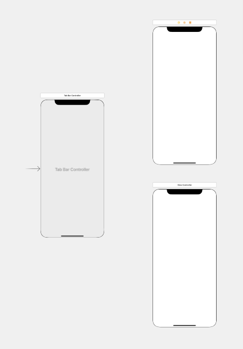

## UITabBarController 추가   
UITabBarController를 Storyboard에 추가하게 되면 기본적으로 UIViewController가 두개 딸려오게 된다.   
이 UIViewController는 삭제하고, 원하는 UIViewController와 연결하여준다.

## UIViewController 추가  
연결은 UITabBarController를 우클릭한 후, Triggered Segues에서 원하는 UIViewController를 view controllers로 추가한다.  
이 방법은 매우 쉽고 빠르지만, 순서를 지정하기 어렵다는 것이 단점이다.   
순서는 보기 옵션에서 코드 보기로 변경 후, Storyboard의 코드 순서를 바꾸면 되니 지금은 순서에 상관없이 연결해준다.  

단순히 연결해주는 것만으로도 Storyboard상 UITabBar에 아이콘과 해당 라벨이 추가되는 것을 확인할 수 있다.  
시뮬레이션으로 확인해보아도 결과는 동일하다.   

## Storyboard Reference 추가  
Application을 개발하다보면 하나의 Storyboard에 연속적으로 추가하는 것이 아니라, 여러 Storyboard로 나누어 작업하게 되는 경우가 많다.  
이럴 때는 Storyboard References를 이용하여 연결할 수 있다.  
Storyboard References를 추가한 후, 기존의 UIViewController의 자리를 대체해준다.  
Storyboard Reference를 정상적으로 사용하려면 Attribute Inspector에서 다른 Storyboard의 이름을 반드시 입력해주어야 한다.  
   

UIViewController를 등록했을 때 처럼 TabBar에 아이콘과 라벨이 추가되게 되는데, 이 TabBar 아이콘은 해당 Storyboard Reference의 Tab bar item에서 수정할 수 있다.    
  

이후, 시뮬레이션으로 확인해보면 Storyboard에서 나오는 3개의 TabBarItem과는 달리, 한 개의 Item이 공백으로 나오는 것을 볼 수 있다.  
  

## UINavigationController 추가  
정상적으로 사용하기 위해 기존에 추가했던 Storyboard Reference 이전에 UINavigationController를 추가한다.  
UINavigationController를 추가하면서 자동으로 생성된 UITableView는 삭제하여준다.  

UITabBarController와 생성한 UINavigationController를, UINavigationController와 Storyboard Reference를 연결한다.  
  

## 결과  
이후 확인해보면 정상적으로 표시되는 것을 확인할 수 있다.  
  
이 방법을 사용하면 각 화면에 UINavigation을 사용할 수 있고, 탭바로 전환하여도 해당 Controller는 현재 화면을 유지한다.  

